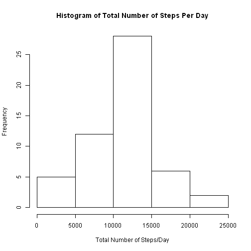
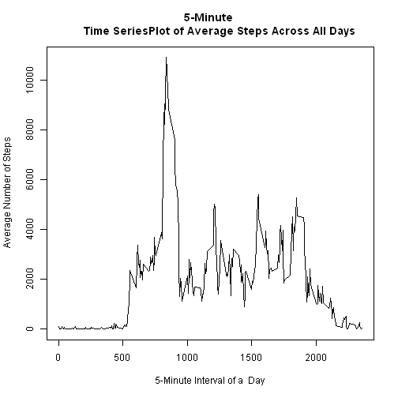
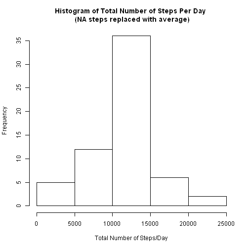
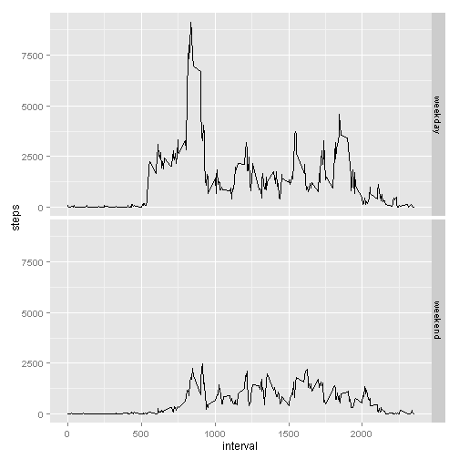

# Activity Monitorying Data Assessment
## Create report and R code to follow steps and answer questions as shown 


###Helpful Information that I used for coding 
Activity monitoring data from github repository that contains the dataset. 
Use of aggregate function is great: http://www.statmethods.net/management/aggregate.html  
Replace NA values:
http://stackoverflow.com/questions/19379081/how-to-replace-na-values-in-a-table-for-selected-columns-data-frame-data-tab 
or http://stackoverflow.com/questions/13172711/replace-na-values-from-a-column-with-0-in-data-frame-r 
ggplot: http://www.cookbook-r.com/Graphs/Facets_(ggplot2)/


## 1. Loading and preprocessing the data
###Load the data

```r
allactivity_data = read.csv('activity.csv') 
```
###View and explore the data 
Column names

```r
names(allactivity_data) 
```

```
## [1] "steps"    "date"     "interval"
```
Summary of RAW data

```r
summary(allactivity_data)
```

```
##      steps              date          interval   
##  Min.   :  0    2012-10-01:  288   Min.   :   0  
##  1st Qu.:  0    2012-10-02:  288   1st Qu.: 589  
##  Median :  0    2012-10-03:  288   Median :1178  
##  Mean   : 37    2012-10-04:  288   Mean   :1178  
##  3rd Qu.: 12    2012-10-05:  288   3rd Qu.:1766  
##  Max.   :806    2012-10-06:  288   Max.   :2355  
##  NA's   :2304   (Other)   :15840
```

## 2. What is the mean total number of steps taken per day? 
###Calculate the total number of steps taken per day

```r
steps_day_sum <- aggregate(steps ~ date, data = allactivity_data, FUN=sum, na.rm = TRUE)
```
###Make histogram of the total number of steps taken per day

```r
hist(steps_day_sum$steps, xlab='Total Number of Steps/Day', main ='Histogram of Total Number of Steps Per Day')
```

 

###Calculate and report the mean and median of the total number of steps taken per day

```r
options(scipen=999, digits=0)
mean_steps <-mean(steps_day_sum$steps)
median_steps <-median(steps_day_sum$steps) 
```
The Median is 10766 steps per day. 
The Mean is 10765 steps per day. 

##3. What is the average daily activity pattern? 

```r
steps_day_mean <- aggregate(steps ~ interval, data = allactivity_data, FUN=sum, na.rm = TRUE)
```
###Make a time series plot 

```r
plot (steps_day_mean$interval, steps_day_mean$steps, xlab='5-Minute Interval of a  Day', ylab='Average Number of Steps', main ='5-Minute 
      Time SeriesPlot of Average Steps Across All Days', type="l")
```

 

###Which 5-minute interval, on average across all the days in the dataset, contains the maximum number of steps?

```r
max_steps_row <-which.max(steps_day_mean$steps)
max_interval <-steps_day_mean$interval[max_steps_row]
```
The 5-minut interval that contains the max number of steps is 835.

##4. Inputting missing values
###Calculate and report the total number of missing values in the data set

```r
No_NA<-sum(is.na(allactivity_data))
```
The total number of missing values is 2304.  

### Devise a Stratgety for filling in NA.
Use mean for that day as offered as a possibility in the assessment directions.

### Create a new dataset that is equal to the original dataset but with missing data filled in. 

```r
activity_noNA <- na.omit(allactivity_data)
mean_value<-mean(activity_noNA$steps) 

activity_replaceNA <- allactivity_data
activity_replaceNA [["steps"]][is.na(activity_replaceNA[["steps"]])] <-mean_value
```

###Make Histogram of NA replaced data and caclualte and report the mean and median total number of steps taken per day.

```r
steps_day_sum2 <- aggregate(steps ~ date, data = activity_replaceNA, FUN=sum, na.rm = TRUE)
hist(steps_day_sum2$steps, xlab='Total Number of Steps/Day', main ='Histogram of Total Number of Steps Per Day \n (NA steps replaced with average)')
```

 

```r
mean_steps2 <-mean(steps_day_sum2$steps)
median_steps2 <-median(steps_day_sum2$steps) 
```
The Median is 10766 steps per day. 
The Mean is 10766 steps per day.
###Do these values differ from the estimates from the fist part and what is the impact of imputting missing data on 
###the estimates of the total daily number of steps.
Median of 10766has gone up slightly from before of 10765, Mean of `mean_steps2`is the same 
This makes sense because replacing the missing data with a mean values would not change the mean value.
It also makes sense that the mediaun is closer to the mean, since more mean values were used. 

## 5. Are there differences in activity patterns between weekdays and weekends? 
###Create a new factor variable in the dataset with two levels - 'weekday' and 'weekend'

```r
allactivity_replaceDay <- allactivity_data
allactivity_replaceDay [,'date'] <- as.POSIXct(allactivity_replaceDay$date) 

allactivity_replaceDay$weekday = weekdays(allactivity_replaceDay$date)

allactivity_replaceDay$weekdayGroup <- ifelse(allactivity_replaceDay$weekday == "Saturday" |
                                                      allactivity_replaceDay$weekday==
                                               "Sunday" , "weekend" , "weekday") 
str(allactivity_replaceDay)
```

```
## 'data.frame':	17568 obs. of  5 variables:
##  $ steps       : int  NA NA NA NA NA NA NA NA NA NA ...
##  $ date        : POSIXct, format: "2012-10-01" "2012-10-01" ...
##  $ interval    : int  0 5 10 15 20 25 30 35 40 45 ...
##  $ weekday     : chr  "Monday" "Monday" "Monday" "Monday" ...
##  $ weekdayGroup: chr  "weekday" "weekday" "weekday" "weekday" ...
```
### Make a time series plot avereaged across all weekday days or weekend days. 


```r
steps_day_mean2 <- aggregate(steps ~ interval + weekdayGroup, data = allactivity_replaceDay, FUN=sum, na.rm = TRUE)
str(steps_day_mean2)
```

```
## 'data.frame':	576 obs. of  3 variables:
##  $ interval    : int  0 5 10 15 20 25 30 35 40 45 ...
##  $ weekdayGroup: chr  "weekday" "weekday" "weekday" "weekday" ...
##  $ steps       : int  91 18 7 8 4 59 28 46 0 72 ...
```

```r
names(steps_day_mean2)
```

```
## [1] "interval"     "weekdayGroup" "steps"
```

```r
library(ggplot2)
print (ggplot() +geom_line (data=steps_day_mean2, aes(x=interval, y=steps)) +facet_grid(weekdayGroup~.))
```

 

The differences in steps that are between weekday and weekends is shown in the above graph. The weekday steps are overall higher.  


